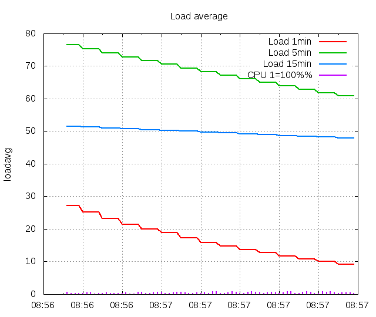
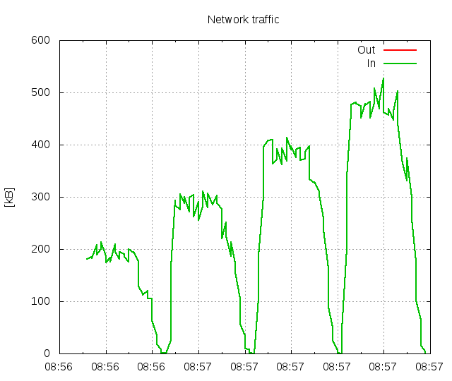
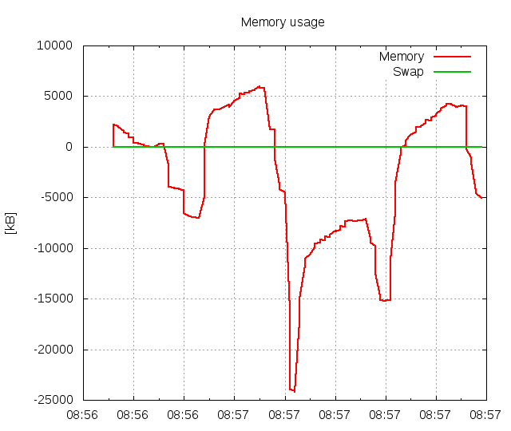
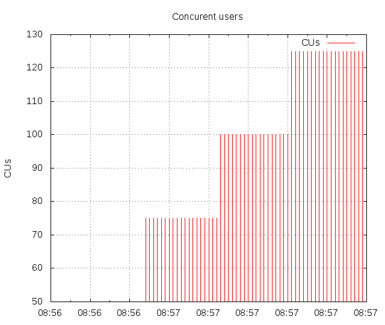

======================
FunkLoad_ bench report
======================

:date: 2017-09-18 08:56:35
:abstract: Simply testing a default static page
           Bench result of ``Simple.test_simple``: 
           Access the main URL 20 times

.. _FunkLoad: http://funkload.nuxeo.org/
.. sectnum::    :depth: 2
.. contents:: Table of contents
.. |APDEXT| replace:: \ :sub:`1.5`

Bench configuration
-------------------

* Launched: 2017-09-18 08:56:35
* From: faiz-VirtualBox
* Test: ``test_Simple.py Simple.test_simple``
* Target server: http://localhost:5002/HTTP
* Cycles of concurrent users: [50, 75, 100, 125]
* Cycle duration: 10s
* Sleeptime between requests: from 0.0s to 0.5s
* Sleeptime between test cases: 0.01s
* Startup delay between threads: 0.01s
* Apdex: |APDEXT|
* FunkLoad_ version: 1.17.1

Bench content
-------------

The test ``Simple.test_simple`` contains: 

* 20 pages
* 0 redirects
* 0 links
* 0 images
* 0 XML-RPC calls

The bench contains:

* 606 tests
* 13829 pages
* 13829 requests

Test stats
----------

The number of Successful **Tests** Per Second (STPS) over Concurrent Users (CUs).

 .. image:: tests.png

 ================== ================== ================== ================== ==================
                CUs               STPS              TOTAL            SUCCESS              ERROR
 ================== ================== ================== ================== ==================
                 50              8.000                 80                 80             0.00%
                 75             12.800                128                128             0.00%
                100             17.900                179                179             0.00%
                125             21.900                219                219             0.00%
 ================== ================== ================== ================== ==================

Page stats
----------

The number of Successful **Pages** Per Second (SPPS) over Concurrent Users (CUs).
Note: an XML-RPC call counts as a page.

 .. image:: pages_spps.png
 .. image:: pages.png

 ================== ================== ================== ================== ================== ================== ================== ================== ================== ================== ================== ================== ================== ================== ==================
                CUs             Apdex*             Rating               SPPS            maxSPPS              TOTAL            SUCCESS              ERROR                MIN                AVG                MAX                P10                MED                P90                P95
 ================== ================== ================== ================== ================== ================== ================== ================== ================== ================== ================== ================== ================== ================== ==================
                 50              1.000          Excellent            196.300            208.000               1963               1963             0.00%              0.000              0.001              0.010              0.000              0.001              0.001              0.002
                 75              1.000          Excellent            296.500            315.000               2965               2965             0.00%              0.000              0.001              0.013              0.000              0.001              0.002              0.002
                100              1.000          Excellent            398.900            428.000               3989               3989             0.00%              0.000              0.001              0.037              0.000              0.001              0.002              0.003
                125              1.000          Excellent            491.200            506.000               4912               4912             0.00%              0.000              0.001              0.033              0.000              0.001              0.003              0.005
 ================== ================== ================== ================== ================== ================== ================== ================== ================== ================== ================== ================== ================== ================== ==================

 \* Apdex |APDEXT|

Request stats
-------------

The number of **Requests** Per Second (RPS) (successful or not) over Concurrent Users (CUs).

 .. image:: requests_rps.png
 .. image:: requests.png
 .. image:: time_rps.png

 ================== ================== ================== ================== ================== ================== ================== ================== ================== ================== ================== ================== ================== ================== ==================
                CUs             Apdex*            Rating*                RPS             maxRPS              TOTAL            SUCCESS              ERROR                MIN                AVG                MAX                P10                MED                P90                P95
 ================== ================== ================== ================== ================== ================== ================== ================== ================== ================== ================== ================== ================== ================== ==================
                 50              1.000          Excellent            196.300            208.000               1963               1963             0.00%              0.000              0.001              0.010              0.000              0.001              0.001              0.002
                 75              1.000          Excellent            296.500            315.000               2965               2965             0.00%              0.000              0.001              0.013              0.000              0.001              0.002              0.002
                100              1.000          Excellent            398.900            428.000               3989               3989             0.00%              0.000              0.001              0.037              0.000              0.001              0.002              0.003
                125              1.000          Excellent            491.200            506.000               4912               4912             0.00%              0.000              0.001              0.033              0.000              0.001              0.003              0.005
 ================== ================== ================== ================== ================== ================== ================== ================== ================== ================== ================== ================== ================== ================== ==================

 \* Apdex |APDEXT|

Slowest requests
----------------

The 5 slowest average response time during the best cycle with **125** CUs:

* In page 017, Apdex rating: Excellent, avg response time: 0.00s, get: ``/HTTP``
  `Get URL`
* In page 002, Apdex rating: Excellent, avg response time: 0.00s, get: ``/HTTP``
  `Get URL`
* In page 020, Apdex rating: Excellent, avg response time: 0.00s, get: ``/HTTP``
  `Get URL`
* In page 003, Apdex rating: Excellent, avg response time: 0.00s, get: ``/HTTP``
  `Get URL`
* In page 019, Apdex rating: Excellent, avg response time: 0.00s, get: ``/HTTP``
  `Get URL`

Monitored hosts
---------------

localhost: The benching and benched machine
~~~~~~~~~~~~~~~~~~~~~~~~~~~~~~~~~~~~~~~~~~~

**MonitorCPU**

**MonitorNetwork**

**MonitorMemFree**

**MonitorCUs**

Page detail stats
-----------------

PAGE 001: Get URL
~~~~~~~~~~~~~~~~~

* Req: 001, get, url ``/HTTP``

     .. image:: request_001.001.png

     ================== ================== ================== ================== ================== ================== ================== ================== ================== ================== ================== ================== ==================
                    CUs             Apdex*             Rating              TOTAL            SUCCESS              ERROR                MIN                AVG                MAX                P10                MED                P90                P95
     ================== ================== ================== ================== ================== ================== ================== ================== ================== ================== ================== ================== ==================
                     50              1.000          Excellent                 80                 80             0.00%              0.000              0.001              0.003              0.000              0.001              0.002              0.002
                     75              1.000          Excellent                128                128             0.00%              0.000              0.001              0.011              0.000              0.001              0.002              0.003
                    100              1.000          Excellent                178                178             0.00%              0.000              0.001              0.015              0.000              0.001              0.003              0.005
                    125              1.000          Excellent                219                219             0.00%              0.000              0.002              0.015              0.000              0.001              0.004              0.006
     ================== ================== ================== ================== ================== ================== ================== ================== ================== ================== ================== ================== ==================

     \* Apdex |APDEXT|

PAGE 002: Get URL
~~~~~~~~~~~~~~~~~

* Req: 001, get, url ``/HTTP``

     .. image:: request_002.001.png

     ================== ================== ================== ================== ================== ================== ================== ================== ================== ================== ================== ================== ==================
                    CUs             Apdex*             Rating              TOTAL            SUCCESS              ERROR                MIN                AVG                MAX                P10                MED                P90                P95
     ================== ================== ================== ================== ================== ================== ================== ================== ================== ================== ================== ================== ==================
                     50              1.000          Excellent                 92                 92             0.00%              0.000              0.001              0.009              0.000              0.001              0.001              0.002
                     75              1.000          Excellent                136                136             0.00%              0.000              0.001              0.005              0.000              0.001              0.002              0.002
                    100              1.000          Excellent                186                186             0.00%              0.000              0.001              0.015              0.000              0.001              0.003              0.005
                    125              1.000          Excellent                222                222             0.00%              0.000              0.002              0.018              0.000              0.001              0.003              0.006
     ================== ================== ================== ================== ================== ================== ================== ================== ================== ================== ================== ================== ==================

     \* Apdex |APDEXT|

PAGE 003: Get URL
~~~~~~~~~~~~~~~~~

* Req: 001, get, url ``/HTTP``

     .. image:: request_003.001.png

     ================== ================== ================== ================== ================== ================== ================== ================== ================== ================== ================== ================== ==================
                    CUs             Apdex*             Rating              TOTAL            SUCCESS              ERROR                MIN                AVG                MAX                P10                MED                P90                P95
     ================== ================== ================== ================== ================== ================== ================== ================== ================== ================== ================== ================== ==================
                     50              1.000          Excellent                102                102             0.00%              0.000              0.001              0.002              0.000              0.001              0.001              0.001
                     75              1.000          Excellent                144                144             0.00%              0.000              0.001              0.005              0.000              0.001              0.001              0.002
                    100              1.000          Excellent                191                191             0.00%              0.000              0.001              0.037              0.000              0.001              0.002              0.004
                    125              1.000          Excellent                235                235             0.00%              0.000              0.002              0.021              0.000              0.001              0.004              0.006
     ================== ================== ================== ================== ================== ================== ================== ================== ================== ================== ================== ================== ==================

     \* Apdex |APDEXT|

PAGE 004: Get URL
~~~~~~~~~~~~~~~~~

* Req: 001, get, url ``/HTTP``

     .. image:: request_004.001.png

     ================== ================== ================== ================== ================== ================== ================== ================== ================== ================== ================== ================== ==================
                    CUs             Apdex*             Rating              TOTAL            SUCCESS              ERROR                MIN                AVG                MAX                P10                MED                P90                P95
     ================== ================== ================== ================== ================== ================== ================== ================== ================== ================== ================== ================== ==================
                     50              1.000          Excellent                111                111             0.00%              0.000              0.001              0.002              0.000              0.001              0.001              0.002
                     75              1.000          Excellent                154                154             0.00%              0.000              0.001              0.006              0.000              0.001              0.001              0.002
                    100              1.000          Excellent                198                198             0.00%              0.000              0.001              0.026              0.000              0.001              0.003              0.005
                    125              1.000          Excellent                238                238             0.00%              0.000              0.001              0.022              0.000              0.001              0.003              0.005
     ================== ================== ================== ================== ================== ================== ================== ================== ================== ================== ================== ================== ==================

     \* Apdex |APDEXT|

PAGE 005: Get URL
~~~~~~~~~~~~~~~~~

* Req: 001, get, url ``/HTTP``

     .. image:: request_005.001.png

     ================== ================== ================== ================== ================== ================== ================== ================== ================== ================== ================== ================== ==================
                    CUs             Apdex*             Rating              TOTAL            SUCCESS              ERROR                MIN                AVG                MAX                P10                MED                P90                P95
     ================== ================== ================== ================== ================== ================== ================== ================== ================== ================== ================== ================== ==================
                     50              1.000          Excellent                113                113             0.00%              0.000              0.001              0.002              0.000              0.000              0.001              0.001
                     75              1.000          Excellent                157                157             0.00%              0.000              0.001              0.006              0.000              0.001              0.001              0.002
                    100              1.000          Excellent                207                207             0.00%              0.000              0.001              0.015              0.000              0.001              0.003              0.004
                    125              1.000          Excellent                243                243             0.00%              0.000              0.001              0.018              0.000              0.001              0.003              0.005
     ================== ================== ================== ================== ================== ================== ================== ================== ================== ================== ================== ================== ==================

     \* Apdex |APDEXT|

PAGE 006: Get URL
~~~~~~~~~~~~~~~~~

* Req: 001, get, url ``/HTTP``

     .. image:: request_006.001.png

     ================== ================== ================== ================== ================== ================== ================== ================== ================== ================== ================== ================== ==================
                    CUs             Apdex*             Rating              TOTAL            SUCCESS              ERROR                MIN                AVG                MAX                P10                MED                P90                P95
     ================== ================== ================== ================== ================== ================== ================== ================== ================== ================== ================== ================== ==================
                     50              1.000          Excellent                108                108             0.00%              0.000              0.001              0.003              0.000              0.001              0.001              0.002
                     75              1.000          Excellent                161                161             0.00%              0.000              0.001              0.005              0.000              0.001              0.001              0.002
                    100              1.000          Excellent                212                212             0.00%              0.000              0.001              0.016              0.000              0.001              0.002              0.004
                    125              1.000          Excellent                253                253             0.00%              0.000              0.001              0.024              0.000              0.001              0.003              0.004
     ================== ================== ================== ================== ================== ================== ================== ================== ================== ================== ================== ================== ==================

     \* Apdex |APDEXT|

PAGE 007: Get URL
~~~~~~~~~~~~~~~~~

* Req: 001, get, url ``/HTTP``

     .. image:: request_007.001.png

     ================== ================== ================== ================== ================== ================== ================== ================== ================== ================== ================== ================== ==================
                    CUs             Apdex*             Rating              TOTAL            SUCCESS              ERROR                MIN                AVG                MAX                P10                MED                P90                P95
     ================== ================== ================== ================== ================== ================== ================== ================== ================== ================== ================== ================== ==================
                     50              1.000          Excellent                104                104             0.00%              0.000              0.001              0.003              0.000              0.001              0.001              0.001
                     75              1.000          Excellent                158                158             0.00%              0.000              0.001              0.013              0.000              0.001              0.001              0.002
                    100              1.000          Excellent                216                216             0.00%              0.000              0.001              0.011              0.000              0.001              0.002              0.003
                    125              1.000          Excellent                258                258             0.00%              0.000              0.001              0.017              0.000              0.001              0.002              0.004
     ================== ================== ================== ================== ================== ================== ================== ================== ================== ================== ================== ================== ==================

     \* Apdex |APDEXT|

PAGE 008: Get URL
~~~~~~~~~~~~~~~~~

* Req: 001, get, url ``/HTTP``

     .. image:: request_008.001.png

     ================== ================== ================== ================== ================== ================== ================== ================== ================== ================== ================== ================== ==================
                    CUs             Apdex*             Rating              TOTAL            SUCCESS              ERROR                MIN                AVG                MAX                P10                MED                P90                P95
     ================== ================== ================== ================== ================== ================== ================== ================== ================== ================== ================== ================== ==================
                     50              1.000          Excellent                102                102             0.00%              0.000              0.001              0.002              0.000              0.001              0.001              0.001
                     75              1.000          Excellent                157                157             0.00%              0.000              0.001              0.004              0.000              0.001              0.001              0.002
                    100              1.000          Excellent                207                207             0.00%              0.000              0.001              0.011              0.000              0.001              0.002              0.003
                    125              1.000          Excellent                265                265             0.00%              0.000              0.001              0.014              0.000              0.001              0.002              0.003
     ================== ================== ================== ================== ================== ================== ================== ================== ================== ================== ================== ================== ==================

     \* Apdex |APDEXT|

PAGE 009: Get URL
~~~~~~~~~~~~~~~~~

* Req: 001, get, url ``/HTTP``

     .. image:: request_009.001.png

     ================== ================== ================== ================== ================== ================== ================== ================== ================== ================== ================== ================== ==================
                    CUs             Apdex*             Rating              TOTAL            SUCCESS              ERROR                MIN                AVG                MAX                P10                MED                P90                P95
     ================== ================== ================== ================== ================== ================== ================== ================== ================== ================== ================== ================== ==================
                     50              1.000          Excellent                101                101             0.00%              0.000              0.001              0.005              0.000              0.001              0.001              0.001
                     75              1.000          Excellent                154                154             0.00%              0.000              0.001              0.004              0.000              0.000              0.001              0.002
                    100              1.000          Excellent                205                205             0.00%              0.000              0.001              0.011              0.000              0.001              0.002              0.003
                    125              1.000          Excellent                262                262             0.00%              0.000              0.001              0.022              0.000              0.001              0.002              0.003
     ================== ================== ================== ================== ================== ================== ================== ================== ================== ================== ================== ================== ==================

     \* Apdex |APDEXT|

PAGE 010: Get URL
~~~~~~~~~~~~~~~~~

* Req: 001, get, url ``/HTTP``

     .. image:: request_010.001.png

     ================== ================== ================== ================== ================== ================== ================== ================== ================== ================== ================== ================== ==================
                    CUs             Apdex*             Rating              TOTAL            SUCCESS              ERROR                MIN                AVG                MAX                P10                MED                P90                P95
     ================== ================== ================== ================== ================== ================== ================== ================== ================== ================== ================== ================== ==================
                     50              1.000          Excellent                100                100             0.00%              0.000              0.001              0.004              0.000              0.000              0.001              0.001
                     75              1.000          Excellent                152                152             0.00%              0.000              0.001              0.004              0.000              0.001              0.001              0.002
                    100              1.000          Excellent                202                202             0.00%              0.000              0.001              0.012              0.000              0.001              0.001              0.002
                    125              1.000          Excellent                260                260             0.00%              0.000              0.001              0.033              0.000              0.001              0.002              0.003
     ================== ================== ================== ================== ================== ================== ================== ================== ================== ================== ================== ================== ==================

     \* Apdex |APDEXT|

PAGE 011: Get URL
~~~~~~~~~~~~~~~~~

* Req: 001, get, url ``/HTTP``

     .. image:: request_011.001.png

     ================== ================== ================== ================== ================== ================== ================== ================== ================== ================== ================== ================== ==================
                    CUs             Apdex*             Rating              TOTAL            SUCCESS              ERROR                MIN                AVG                MAX                P10                MED                P90                P95
     ================== ================== ================== ================== ================== ================== ================== ================== ================== ================== ================== ================== ==================
                     50              1.000          Excellent                100                100             0.00%              0.000              0.001              0.002              0.000              0.000              0.001              0.002
                     75              1.000          Excellent                152                152             0.00%              0.000              0.001              0.005              0.000              0.000              0.001              0.002
                    100              1.000          Excellent                202                202             0.00%              0.000              0.001              0.011              0.000              0.001              0.001              0.002
                    125              1.000          Excellent                252                252             0.00%              0.000              0.001              0.017              0.000              0.001              0.002              0.003
     ================== ================== ================== ================== ================== ================== ================== ================== ================== ================== ================== ================== ==================

     \* Apdex |APDEXT|

PAGE 012: Get URL
~~~~~~~~~~~~~~~~~

* Req: 001, get, url ``/HTTP``

     .. image:: request_012.001.png

     ================== ================== ================== ================== ================== ================== ================== ================== ================== ================== ================== ================== ==================
                    CUs             Apdex*             Rating              TOTAL            SUCCESS              ERROR                MIN                AVG                MAX                P10                MED                P90                P95
     ================== ================== ================== ================== ================== ================== ================== ================== ================== ================== ================== ================== ==================
                     50              1.000          Excellent                100                100             0.00%              0.000              0.001              0.004              0.000              0.001              0.001              0.001
                     75              1.000          Excellent                151                151             0.00%              0.000              0.001              0.012              0.000              0.000              0.001              0.002
                    100              1.000          Excellent                202                202             0.00%              0.000              0.001              0.033              0.000              0.000              0.001              0.002
                    125              1.000          Excellent                250                250             0.00%              0.000              0.001              0.011              0.000              0.001              0.002              0.002
     ================== ================== ================== ================== ================== ================== ================== ================== ================== ================== ================== ================== ==================

     \* Apdex |APDEXT|

PAGE 013: Get URL
~~~~~~~~~~~~~~~~~

* Req: 001, get, url ``/HTTP``

     .. image:: request_013.001.png

     ================== ================== ================== ================== ================== ================== ================== ================== ================== ================== ================== ================== ==================
                    CUs             Apdex*             Rating              TOTAL            SUCCESS              ERROR                MIN                AVG                MAX                P10                MED                P90                P95
     ================== ================== ================== ================== ================== ================== ================== ================== ================== ================== ================== ================== ==================
                     50              1.000          Excellent                100                100             0.00%              0.000              0.001              0.002              0.000              0.000              0.002              0.002
                     75              1.000          Excellent                150                150             0.00%              0.000              0.001              0.006              0.000              0.001              0.002              0.003
                    100              1.000          Excellent                201                201             0.00%              0.000              0.001              0.009              0.000              0.001              0.001              0.002
                    125              1.000          Excellent                250                250             0.00%              0.000              0.001              0.020              0.000              0.001              0.002              0.004
     ================== ================== ================== ================== ================== ================== ================== ================== ================== ================== ================== ================== ==================

     \* Apdex |APDEXT|

PAGE 014: Get URL
~~~~~~~~~~~~~~~~~

* Req: 001, get, url ``/HTTP``

     .. image:: request_014.001.png

     ================== ================== ================== ================== ================== ================== ================== ================== ================== ================== ================== ================== ==================
                    CUs             Apdex*             Rating              TOTAL            SUCCESS              ERROR                MIN                AVG                MAX                P10                MED                P90                P95
     ================== ================== ================== ================== ================== ================== ================== ================== ================== ================== ================== ================== ==================
                     50              1.000          Excellent                 99                 99             0.00%              0.000              0.001              0.002              0.000              0.001              0.001              0.001
                     75              1.000          Excellent                150                150             0.00%              0.000              0.001              0.009              0.000              0.000              0.001              0.002
                    100              1.000          Excellent                200                200             0.00%              0.000              0.001              0.010              0.000              0.001              0.001              0.002
                    125              1.000          Excellent                250                250             0.00%              0.000              0.001              0.011              0.000              0.001              0.002              0.004
     ================== ================== ================== ================== ================== ================== ================== ================== ================== ================== ================== ================== ==================

     \* Apdex |APDEXT|

PAGE 015: Get URL
~~~~~~~~~~~~~~~~~

* Req: 001, get, url ``/HTTP``

     .. image:: request_015.001.png

     ================== ================== ================== ================== ================== ================== ================== ================== ================== ================== ================== ================== ==================
                    CUs             Apdex*             Rating              TOTAL            SUCCESS              ERROR                MIN                AVG                MAX                P10                MED                P90                P95
     ================== ================== ================== ================== ================== ================== ================== ================== ================== ================== ================== ================== ==================
                     50              1.000          Excellent                 98                 98             0.00%              0.000              0.001              0.006              0.000              0.001              0.001              0.002
                     75              1.000          Excellent                149                149             0.00%              0.000              0.001              0.005              0.000              0.001              0.001              0.002
                    100              1.000          Excellent                200                200             0.00%              0.000              0.001              0.006              0.000              0.001              0.002              0.003
                    125              1.000          Excellent                250                250             0.00%              0.000              0.001              0.013              0.000              0.001              0.002              0.004
     ================== ================== ================== ================== ================== ================== ================== ================== ================== ================== ================== ================== ==================

     \* Apdex |APDEXT|

PAGE 016: Get URL
~~~~~~~~~~~~~~~~~

* Req: 001, get, url ``/HTTP``

     .. image:: request_016.001.png

     ================== ================== ================== ================== ================== ================== ================== ================== ================== ================== ================== ================== ==================
                    CUs             Apdex*             Rating              TOTAL            SUCCESS              ERROR                MIN                AVG                MAX                P10                MED                P90                P95
     ================== ================== ================== ================== ================== ================== ================== ================== ================== ================== ================== ================== ==================
                     50              1.000          Excellent                 97                 97             0.00%              0.000              0.001              0.008              0.000              0.000              0.001              0.001
                     75              1.000          Excellent                149                149             0.00%              0.000              0.001              0.007              0.000              0.001              0.002              0.002
                    100              1.000          Excellent                200                200             0.00%              0.000              0.001              0.009              0.000              0.001              0.002              0.004
                    125              1.000          Excellent                248                248             0.00%              0.000              0.001              0.015              0.000              0.001              0.003              0.007
     ================== ================== ================== ================== ================== ================== ================== ================== ================== ================== ================== ================== ==================

     \* Apdex |APDEXT|

PAGE 017: Get URL
~~~~~~~~~~~~~~~~~

* Req: 001, get, url ``/HTTP``

     .. image:: request_017.001.png

     ================== ================== ================== ================== ================== ================== ================== ================== ================== ================== ================== ================== ==================
                    CUs             Apdex*             Rating              TOTAL            SUCCESS              ERROR                MIN                AVG                MAX                P10                MED                P90                P95
     ================== ================== ================== ================== ================== ================== ================== ================== ================== ================== ================== ================== ==================
                     50              1.000          Excellent                 94                 94             0.00%              0.000              0.001              0.004              0.000              0.001              0.001              0.003
                     75              1.000          Excellent                149                149             0.00%              0.000              0.001              0.009              0.000              0.001              0.002              0.004
                    100              1.000          Excellent                198                198             0.00%              0.000              0.001              0.018              0.000              0.001              0.002              0.003
                    125              1.000          Excellent                247                247             0.00%              0.000              0.002              0.020              0.000              0.001              0.003              0.007
     ================== ================== ================== ================== ================== ================== ================== ================== ================== ================== ================== ================== ==================

     \* Apdex |APDEXT|

PAGE 018: Get URL
~~~~~~~~~~~~~~~~~

* Req: 001, get, url ``/HTTP``

     .. image:: request_018.001.png

     ================== ================== ================== ================== ================== ================== ================== ================== ================== ================== ================== ================== ==================
                    CUs             Apdex*             Rating              TOTAL            SUCCESS              ERROR                MIN                AVG                MAX                P10                MED                P90                P95
     ================== ================== ================== ================== ================== ================== ================== ================== ================== ================== ================== ================== ==================
                     50              1.000          Excellent                 93                 93             0.00%              0.000              0.001              0.005              0.000              0.001              0.001              0.002
                     75              1.000          Excellent                143                143             0.00%              0.000              0.001              0.008              0.000              0.001              0.002              0.003
                    100              1.000          Excellent                197                197             0.00%              0.000              0.001              0.010              0.000              0.001              0.003              0.004
                    125              1.000          Excellent                244                244             0.00%              0.000              0.001              0.021              0.000              0.001              0.003              0.005
     ================== ================== ================== ================== ================== ================== ================== ================== ================== ================== ================== ================== ==================

     \* Apdex |APDEXT|

PAGE 019: Get URL
~~~~~~~~~~~~~~~~~

* Req: 001, get, url ``/HTTP``

     .. image:: request_019.001.png

     ================== ================== ================== ================== ================== ================== ================== ================== ================== ================== ================== ================== ==================
                    CUs             Apdex*             Rating              TOTAL            SUCCESS              ERROR                MIN                AVG                MAX                P10                MED                P90                P95
     ================== ================== ================== ================== ================== ================== ================== ================== ================== ================== ================== ================== ==================
                     50              1.000          Excellent                 86                 86             0.00%              0.000              0.001              0.001              0.000              0.001              0.001              0.001
                     75              1.000          Excellent                138                138             0.00%              0.000              0.001              0.008              0.000              0.001              0.002              0.004
                    100              1.000          Excellent                196                196             0.00%              0.000              0.001              0.009              0.000              0.001              0.002              0.003
                    125              1.000          Excellent                236                236             0.00%              0.000              0.002              0.021              0.000              0.001              0.004              0.006
     ================== ================== ================== ================== ================== ================== ================== ================== ================== ================== ================== ================== ==================

     \* Apdex |APDEXT|

PAGE 020: Get URL
~~~~~~~~~~~~~~~~~

* Req: 001, get, url ``/HTTP``

     .. image:: request_020.001.png

     ================== ================== ================== ================== ================== ================== ================== ================== ================== ================== ================== ================== ==================
                    CUs             Apdex*             Rating              TOTAL            SUCCESS              ERROR                MIN                AVG                MAX                P10                MED                P90                P95
     ================== ================== ================== ================== ================== ================== ================== ================== ================== ================== ================== ================== ==================
                     50              1.000          Excellent                 83                 83             0.00%              0.000              0.001              0.010              0.000              0.001              0.001              0.002
                     75              1.000          Excellent                133                133             0.00%              0.000              0.001              0.008              0.000              0.001              0.002              0.003
                    100              1.000          Excellent                191                191             0.00%              0.000              0.001              0.016              0.000              0.001              0.002              0.003
                    125              1.000          Excellent                230                230             0.00%              0.000              0.002              0.017              0.000              0.001              0.003              0.006
     ================== ================== ================== ================== ================== ================== ================== ================== ================== ================== ================== ================== ==================

     \* Apdex |APDEXT|

Definitions
-----------

* CUs: Concurrent users or number of concurrent threads executing tests.
* Request: a single GET/POST/redirect/XML-RPC request.
* Page: a request with redirects and resource links (image, css, js) for an HTML page.
* STPS: Successful tests per second.
* SPPS: Successful pages per second.
* RPS: Requests per second, successful or not.
* maxSPPS: Maximum SPPS during the cycle.
* maxRPS: Maximum RPS during the cycle.
* MIN: Minimum response time for a page or request.
* AVG: Average response time for a page or request.
* MAX: Maximmum response time for a page or request.
* P10: 10th percentile, response time where 10 percent of pages or requests are delivered.
* MED: Median or 50th percentile, response time where half of pages or requests are delivered.
* P90: 90th percentile, response time where 90 percent of pages or requests are delivered.
* P95: 95th percentile, response time where 95 percent of pages or requests are delivered.
* Apdex T: Application Performance Index,
  this is a numerical measure of user satisfaction, it is based
  on three zones of application responsiveness:

  - Satisfied: The user is fully productive. This represents the
    time value (T seconds) below which users are not impeded by
    application response time.

  - Tolerating: The user notices performance lagging within
    responses greater than T, but continues the process.

  - Frustrated: Performance with a response time greater than 4*T
    seconds is unacceptable, and users may abandon the process.

    By default T is set to 1.5s. This means that response time between 0
    and 1.5s the user is fully productive, between 1.5 and 6s the
    responsivness is tolerable and above 6s the user is frustrated.

    The Apdex score converts many measurements into one number on a
    uniform scale of 0-to-1 (0 = no users satisfied, 1 = all users
    satisfied).

    Visit http://www.apdex.org/ for more information.
* Rating: To ease interpretation, the Apdex score is also represented
  as a rating:

  - U for UNACCEPTABLE represented in gray for a score between 0 and 0.5

  - P for POOR represented in red for a score between 0.5 and 0.7

  - F for FAIR represented in yellow for a score between 0.7 and 0.85

  - G for Good represented in green for a score between 0.85 and 0.94

  - E for Excellent represented in blue for a score between 0.94 and 1.

Report generated with FunkLoad_ 1.17.1, more information available on the `FunkLoad site <http://funkload.nuxeo.org/#benching>`_.